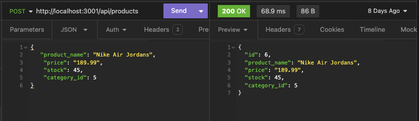

  # E-Commerce Routing

  

  ## Description
  A command line interface, utilized with postgresql to manage data for an internet retail company

  ## URL of Repository

  [tjmcd2010 Github Repository](https://github.com/tjmcd2010/E-Commerce-Routing)

  ## Demonstration of Deployed Application

  [Video Demonstration](https://drive.google.com/file/d/1-mvtt4lZsW4ONldGuN258PAQiDG3GJtu/view?usp=sharing)

  ## Screenshots of Deployed Application

  
  
  
  
    

  ## Table of Contents
  - [Installation](#installation)
  - [Usage](#usage)
  - [Contributing](#contributing)
  - [Tests](#tests)
  - [Technologies](#technologies)
  - [License](#license)
  - [Questions](#questions)

  ## Installation
  You will simply need to clone the repository, enter npm start into your command line interface and follow the prompts

  ## Usage
  This would be useful for an internet retail company to keep track of invetory and pricing

  ## Contributing
  N/A

  ## Tests
  N/A

  ## Technologies Used
  
  Node.js, Express.js, postgreSQL, Sequelize, 

   ## License
  MIT

  ## Questions

  For any additional questions or feedback, please contact me with the following information:
  Github: (https://github.com/tjmcd2010)
  Email: (mailto:tjmcd2010@gmail.com)  

